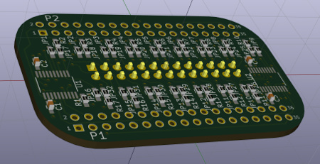
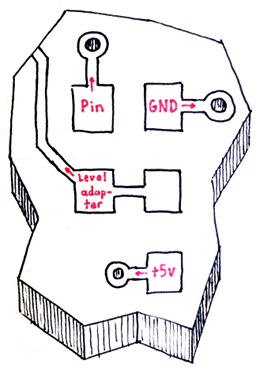
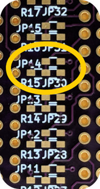
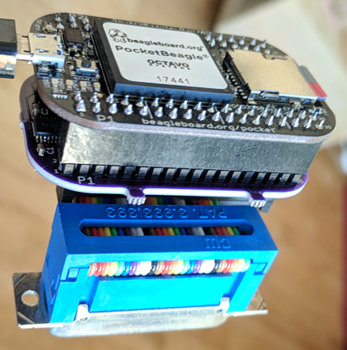
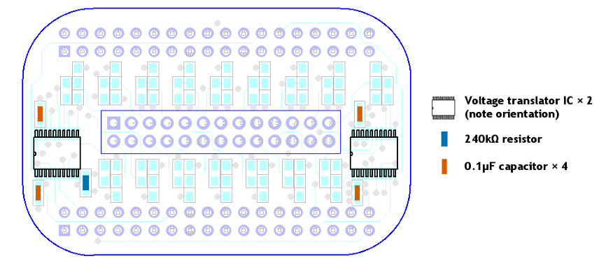
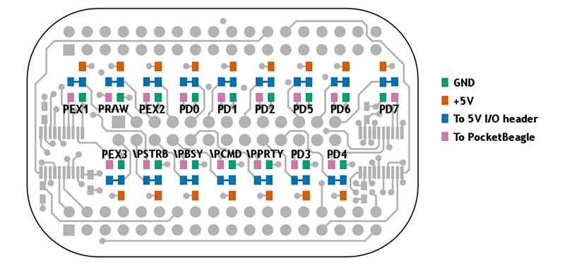

# Cameo

is a peripheral [cape](https://beagleboard.org/capes) circuit board that allows
the [PocketBeagle](http://beagleboard.org/pocket) single-board computer (which
uses 3.3V digital signals) to interface with 5V digital logic. It is built
around two Texas Instruments [TXS0108EPWR]( http://www.ti.com/product/TXS0108E)
or [TXB0108PWR]( http://www.ti.com/product/TXB0108) 8-bit bidirectional voltage
level translator ICs. Sixteen digital I/O signal lines are available.

Cameo is optimised for applications that take advantage of the two [PRU-ICSS](
https://beagleboard.org/pru) real-time coprocessors built into the chip-like
hybrid circuit that powers the PocketBeagle (a [TI AM3358](
http://www.ti.com/product/AM3358) SoC/[Octavo OSD3358](
https://octavosystems.com/octavo_products/osd335x/) SiP). The digital I/O lines
that pass through Cameo include all fourteen logic lines the PRUs can access
directly in either the input or output direction. The two remaining lines are
one that PRU 0 can use for output only and one it can use for input only, the
latter of which also happens to be the CLOCKIN line for the PRU's "parallel
capture" input mode. Alternatively, all lines may be used bidirectionally via
the AM3358's GPIO modules.

Cameo is "plugboard programmable": a pattern of jumper pads on the cape allow
each signal line to be individually tied/pulled to GND or +5V, or to be
[terminated](https://www.youtube.com/watch?v=rN9zjVK3Nrk) in a variety of ways,
all through installation of appropriate 0603 surface-mount components (or, in a
pinch, solder bridges or small fragments of wire). See the [plugboard pad map](
#plugboard-pad-map) for a diagram showing all of the "plugboard" pads.

## Fair warning

Cameo and associated hardware designs, software materials, and other resources
distributed alongside it are all made available for free with NO WARRANTY OF
ANY KIND. Any system that interfaces with Cameo could suffer malfunction, data
loss, physical damage, or other harms. Some of these effects could be permanent
and/or unrepairable. If you're not prepared to risk these consequences, don't
use Cameo.

## Example applications

* [ Aphid](aphid/),
  a hardware emulator for Apple parallel port hard drives.

## Assembly and installation

Cameo is designed to mount underneath the PocketBeagle, preserving easy access
to the PocketBeagle's soft power button. The pin header for 5V digital I/O is
mounted on the underside of Cameo. With a short ribbon cable like the one in
the photo, the entire lightweight "stack" can dangle from a computer peripheral
port, as long as clearances and the security/fastness of the connector allow.

### Costs

To build a ready-to-use "stack" of your own from parts, you will need (prices
for informational purposes only; many are likely out-of-date):

* A PocketBeagle compact single-board computer ($25)
* A Cameo printed circuit board ($10 per board, **but sold only in packs of 3**
  from [OSH Park](https://www.oshpark.com/shared_projects/51GWu9Kw); shop around
  for deals by uploading the Gerber or KiCad project files in the
  [hardware directory](hardware) to online PCB manufacturers)
* Two TXS0108EPWR bidirectional level translator ICs ([e.g.](
  https://www.digikey.com/short/jr94zw); $1.66 each)
* Four 0.1μF MLCC 0603 surface mount capacitors ([e.g.](
  https://www.digikey.com/short/jr9znz); $0.10 each)
* One 240kΩ 0603 surface mount resistor ([e.g.](
  https://www.digikey.com/short/jrvd8z); $0.10 for just one)
* One 2x13 0.1" pitch pin header ([e.g.](https://www.digikey.com/short/jr9439);
  plastic shroud at your discretion; $0.30)
* Two 2x18 0.1" pitch pin headers ([e.g.](https://www.digikey.com/short/jr94b9);
  $0.66 each)
* Two 2x18 0.1" pitch sockets ([e.g.](https://www.digikey.com/short/jr94rq);
  $2.06 each)
* MicroSD memory card, 4GB or more, class 10 or better ($7 or so)
* Jumper and termination 0603 surface-mount components as required by your
  application (assuming just one 0Ω jumper ([e.g.](
  https://www.digikey.com/short/jr9m80)) per I/O pin, $0.85 for all 16; free
  if you make your own from scrap wire)

costing $52.41 in total. If you are willing to bond the PocketBeagle and Cameo
together permanently, you can omit the 2x18 sockets and save a bit over $4.

Some applications may benefit from adapting the 26-pin header on the bottom of
Cameo to a 25-pin DB-25 plug connector. To make this adapter, you can use:

* 2x13 0.1" pitch socket with IDC crimp termination ([e.g.](
  https://www.digikey.com/short/jrbw3d), $0.58)
* DB-25 plug connector with IDC crimp termination ([e.g.](
  https://www.digikey.com/short/jrb2dj), $2.33)
* A short length (around 5cm) of 26-pin ribbon cable. ([e.g.](
  https://www.digikey.com/short/jrb2rr); $1.28 for a foot, ideally scrounged
  from a junk drawer for free)

adding to an additional $4.19.

### Assembly

Cameo is not an ideal starter project for hobbyists new to soldering
surface-mounted components; on the other hand, it doesn't have too many of
them, and they're not very tightly packed. The following diagram shows the
locations of essential SMD components on Cameo:

More SMD components will be required to set up the "plugboard" that connects
PocketBeagle signal lines to pins on the 5V I/O header. The specific nature and
configuration of these components are application-specific. See the
[introduction](#cameo) and the [plugboard pad map](#plugboard-pad-map) for more
details of the plugboard.

When assembling the Cameo board, it may be advisable to place the two voltage
translater ICs first, followed by the discrete SMD components and then by the
through-hole headers/connectors. **Remember, Cameo expects to be slung
underneath the PocketBeagle, so the 5V I/O header (centre) should emerge from
the bottom of the board, while the headers (or sockets) for connecting to the
PocketBeagle should emerge from the top.**

To connect to Cameo, the PocketBeagle will need sockets (or headers) emerging
from the **bottom** of its PCB. When mating Cameo to the PocketBeagle, be
certain of the correct orientation: if Cameo is orientated as shown above, the
USB connector on the PocketBeagle should be visible and pointing leftward.

Refer to online tutorials for making ribbon cable assemblies with IDC
connectors ([e.g.](https://startingelectronics.org/articles/IDC-ribbon-cable/))
to build an adaptor for the 5V I/O header. In general, it's best for the cable
between the two connectors to be as short as possible.

## Header pinout

The follwing pinout diagram represents Cameo's 26-pin 5V I/O header as viewed
from the underside of the Cameo PCB, with the PocketBeagle's USB connector
pointing upward.

| GPIO | PRU | PB pin | |   Name | I/O pin | I/O pin | Name   | | PB pin | PRU | GPIO |
|-----:|----:|-------:|-|-------:|:-------:|:-------:|:-------|-|:-------|:----|:-----|
|      |     |        | | _n/c_  |  **1**  |  **2**  |  PEX3  | | P1.35  | 1 ⇆ | 2.24 |
| 1.10 | ⇆ 1 |  P1.32 | |  PEX1  |  **3**  |  **4**  | \PSTRB | | P2.9   | 0 ← | 0.15 |
| 1.11 | ⇆ 1 |  P1.30 | | PR/\W  |  **5**  |  **6**  | \PBSY  | | P2.35  | 1 ⇆ | 2.22 |
| 2.25 | ⇆ 1 |   P1.4 | |  PEX2  |  **7**  |  **8**  | \PCMD  | | P1.2   | 1 ⇆ | 2.23 |
| 3.14 | ⇆ 0 |  P1.36 | |   PD0  |  **9**  | **10**  |\PPARITY| | P2.24  | 0 → | 1.12 |
| 3.15 | ⇆ 0 |  P1.33 | |   PD1  |  **11** | **12**  |   ⏚    | |        |     |      |
|      |     |        | |  _n/c_ |  **13** | **14**  |   ⏚    | |        |     |      |
| 3.16 | ⇆ 0 |  P2.32 | |   PD2  |  **15** | **16**  | _n/c_  | |        |     |      |
|      |     |        | |    ⏚   |  **17** | **18**  |  PD3   | | P2.30  | 0 ⇆ | 3.17 |
|      |     |        | |    ⏚   |  **19** | **20**  |  PD4   | | P1.31  | 0 ⇆ | 3.18 |
| 3.19 | ⇆ 0 |  P2.34 | |   PD5  |  **21** | **22**  |   ⏚    | |        |     |      |
| 3.20 | ⇆ 0 |  P2.28 | |   PD6  |  **23** | **24**  |   ⏚    | |        |     |      |
| 3.21 | ⇆ 0 |  P1.29 | |   PD7  |  **25** | **26**  |   ⏚    | |        |     |      |

The names of the 5V I/O pins reflect one of the example applications and should
be considered arbitrary. Pins marked _n/c_ connect to nothing; pins marked ⏚
are tied to ground.

The "PB pin" column shows which PocketBeagle header pin connects to Cameo's 5V
I/O header (through the 3.3V ⇆ 5V bidirectional voltage level translator ICs).

The "PRU" columns show which of the two PRU-ICSS real-time coprocessors in the
AM3358 are connected to each pin. A ⇆ symbol means that the corresponding
PocketBeagle pin can be configured either as an input to or an output of the
PRU; the ← and → symbols mean that the pin can only be a PRU input or output
respectively. Pins PD0-PD7 in particular map to PRU 0 GPIO bits 0-7.

The "GPIO" columns show how the pins correspond to I/O bits in the AM3358's
GPIO modules ("3.21" means module 3, bit 21). All pins may be accessed in any
direction through the GPIO subsystem.

For more detailed connectivity information, refer to the expansion header
tables in the [PocketBeagle reference manual](
https://github.com/beagleboard/pocketbeagle/wiki/System-Reference-Manual#71_Expansion_Header_Connectors).

Note finally that if an ordinary ribbon cable is used in an adaptor that
connects the 5V I/O header to a DB-25 plug connector, the pin numbering
patterns for both are different:

| DB-25 pin  | 1 | 2 | 3 | 4 | 5 |  6 |  7 |  8 |  9 | 10 | 11 | 12 | 13 |
|------------|---|---|---|---|---|----|----|----|----|----|----|----|----|
| Header pin | 1 | 3 | 5 | 7 | 9 | 11 | 13 | 15 | 17 | 19 | 21 | 23 | 25 |

| DB-25 pin  | 14 | 15 | 16 | 17 | 18 | 19 | 20 | 21 | 22 | 23 | 24 | 25 |
|------------|----|----|----|----|----|----|----|----|----|----|----|----|
| Header pin |  2 |  4 |  6 |  8 | 10 | 12 | 14 | 16 | 18 | 20 | 22 | 24 |

## Plugboard pad map

This diagram shows a top-side view of Cameo. (In this view, the through-holes
for the 26-pin 5V I/O header (centre) are "flipped" about the header's long
(horiziontal) axis, since the pins emerge from the underside of the board.)

The installation of jumpers, resistors, or other 0603 surface mount components
on each set of five pads shaped like ⠾, ⠻, or ⠷ determines whether and how the
labeled pin connects (through the voltage translator ICs) to the PocketBeagle.

## Development

Cameo was designed with [KiCad](http://kicad-pcb.org/) 4.  Project files and
derived products (Gerber files, etc.) are kept in the [hardware](hardware/)
subdirectory.

## Other notes

To the fullest extent possible, Cameo is released into the public domain.
Nobody owns Cameo.

## Acknowledgements

It would not have been possible for me to design Cameo without the help of the
following people and resources:

* Michael Welling's [pocketbeagle-cape-template](
  https://github.com/mwelling/pocketbeagle-cape-template).
* The [Sitara Processors Forum](https://e2e.ti.com/support/arm/sitara_arm) on
  the [TI E2E Community](https://e2e.ti.com/).
* Anonymous friends.

-- [_Tom Stepleton_](mailto:stepleton@gmail.com), 11 August 2018, London
